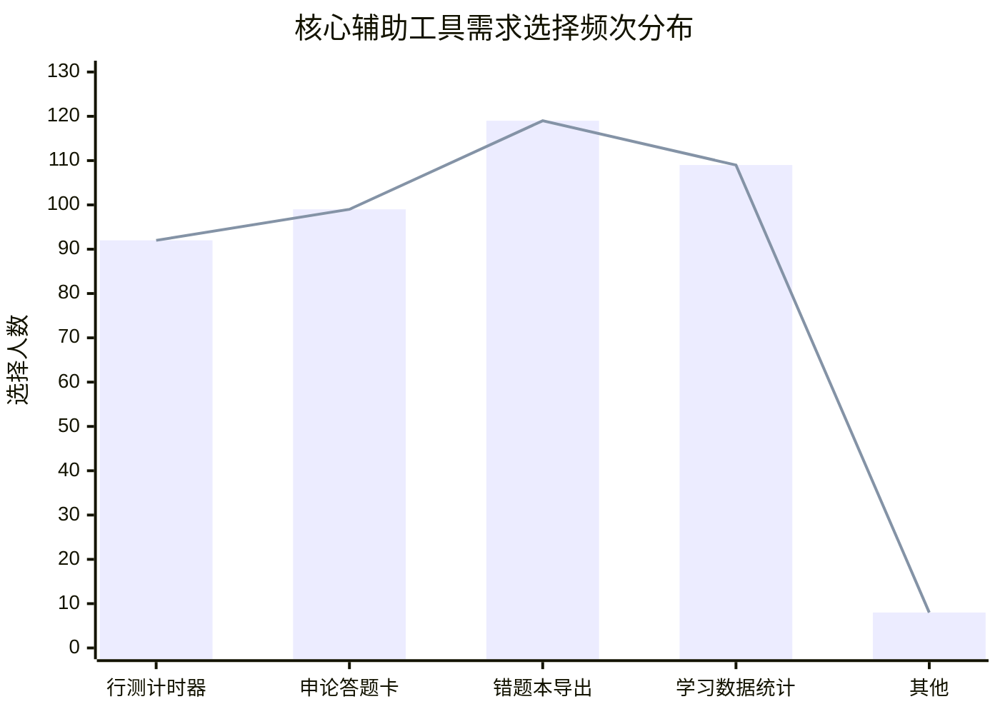

```mermaid
xychart-beta
    title "核心辅助工具需求选择频次分布"
    x-axis ["行测计时器", "申论答题卡", "错题本导出", "学习数据统计", "其他"]
    y-axis "选择人数" 0 --> 130
    bar [92, 99, 119, 109, 8]
    line [92, 99, 119, 109, 8]
```