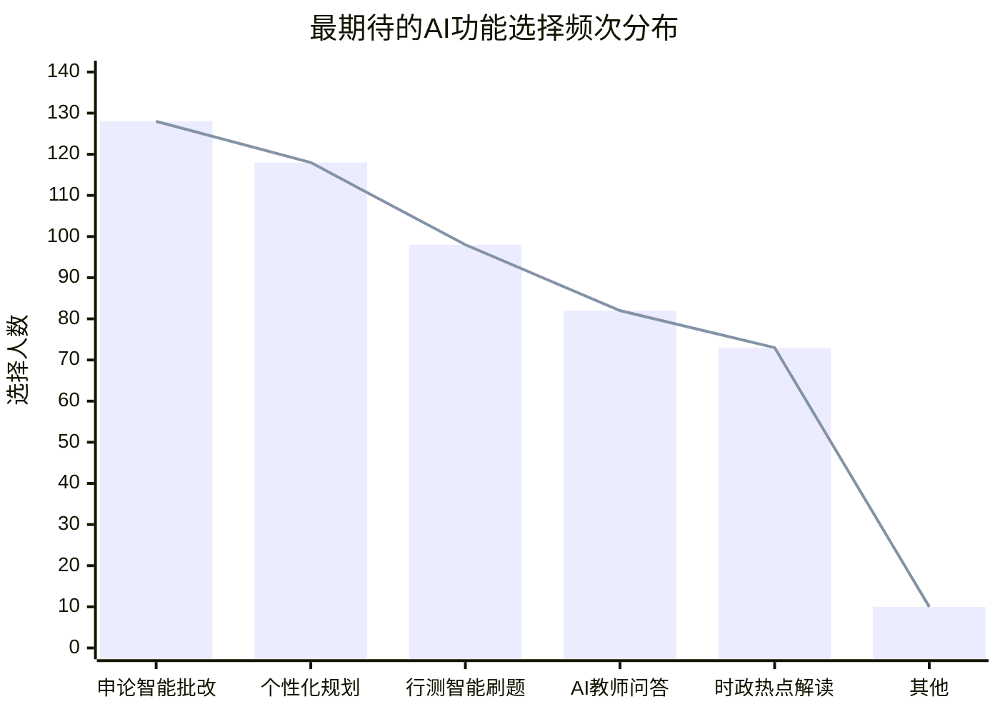

```mermaid
xychart-beta
    title "最期待的AI功能选择频次分布"
    x-axis ["申论智能批改", "个性化规划", "行测智能刷题", "AI教师问答", "时政热点解读", "其他"]
    y-axis "选择人数" 0 --> 140
    bar [128, 118, 98, 82, 73, 10]
    line [128, 118, 98, 82, 73, 10]
```